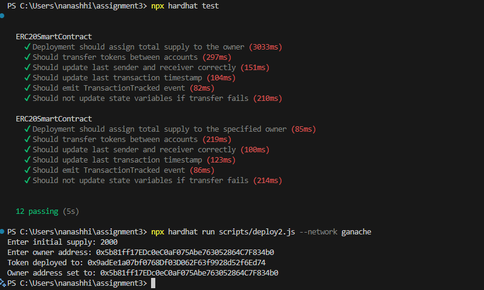

# Team: Tomiris Tapen SE-2316, Ayaulym Kenzhekul SE-2314, Danial Yerzhigit SE-2314
# Project Description

This project is a blockchain-based application built using the Hardhat development environment. It includes smart contracts, scripts, and testing infrastructure to deploy, manage, and interact with decentralized applications (dApps). The main focus appears to be on managing transactions, validating contract functionality, and implementing ERC20 tokens for creating fungible, Ethereum-compatible tokens used in payments, staking, and tokenized systems.

## Key Features
- Smart contracts written in Solidity.
- Deployment and testing framework using Hardhat.
- Scripts to deploy and verify contracts.
- Testing suite for validating contract functionality.
- Includes pre-configured caching and artifact directories.
---
### Prerequisites
Ensure you have the following installed:
1. **Node.js** (version 14.x or later)
2. **npm** (comes with Node.js)
3. **Hardhat** (installed as part of dependencies)

### Installation
1. Clone the repository:
```bash
   git clone https://github.com/tomiristapen/assignment3_part2.git
   cd assignment3_part2
   ```
2. Install dependencies:
   ```bash
   npm install
   ```

3.
   ```bash
   npx hardhat
   ``` 
---

# How to Run

### Running the Development Environment
1. Compile the smart contracts:
   ```bash
   npx hardhat compile
   ```
### Deploying Contracts
2. Deploy contracts to the local network:
   ```bash
   npx hardhat run scripts/deploy.js --network ganache
   ```

3. interact.js to see the functionalities:
  ```bash
  npx hardhat run scripts/interact.js --network ganache
  ```
  


import tokens to metamask ganache account:


---

**The ERC20 token implementation in this project includes the following essential functions:**

- totalSupply(): Returns the total token supply.
- balanceOf(address account): Returns the balance of a specific account.
- transfer(address recipient, uint256 amount): Transfers tokens to a specified address.
- approve(address spender, uint256 amount): Approves a spender to transfer tokens on behalf of the owner.
- transferFrom(address sender, address recipient, uint256 amount): Executes a transfer on behalf of another address.
- allowance(address owner, address spender): Returns the remaining number of tokens a spender is allowed to spend.

**Test for initial smart contract:**
---
Key Tests:

- Deployment Test: Verifies that the total supply is assigned to the owner upon deployment.
- Transfer Test: Tests token transfers between accounts and verifies the balances.
- Event Emission Test: Checks that the Transfer event is emitted correctly during a transfer.
- Last Sender/Receiver Test: Verifies that the contract correctly tracks the last sender and receiver addresses.
- Last Timestamp Test: Verifies that the contract correctly tracks the timestamp of the last transaction.



**The image shows the execution of two Hardhat commands in a terminal:**
- Running Tests (npx hardhat test)  All test cases have passed successfully.
- Deploying the Modified Smart Contract (npx hardhat run scripts/deploy2.js --network ganache) with inputs

**Modified Smart Contract: AITU_SE_2314_16Token2.sol**
---
Changes:
- Constructor: Accepts initialSupply and ownerAddress to initialize the token supply and owner address.
- Transfer Function: Overrides the transfer function to update lastSender, lastReceiver, and lastTimestamp.
- Helper Functions: Provides functions to retrieve the last sender, receiver, and a human-readable timestamp of the last transaction.

**test_v2.js for modified smart contract:**
---
Key Tests:

- Deployment Test: Verifies that the total supply is assigned to the specified owner upon deployment.
- Transfer Test: Tests token transfers between accounts and verifies the balances.
- Event Emission Test: Checks that the Transfer event is emitted correctly during a transfer.
- Last Sender/Receiver Test: Verifies that the contract correctly tracks the last sender and receiver addresses.
- Last Timestamp Test: Verifies that the contract correctly tracks the timestamp of the last transaction.

# License
This project is licensed under the terms specified in the `LICENSE` file.
